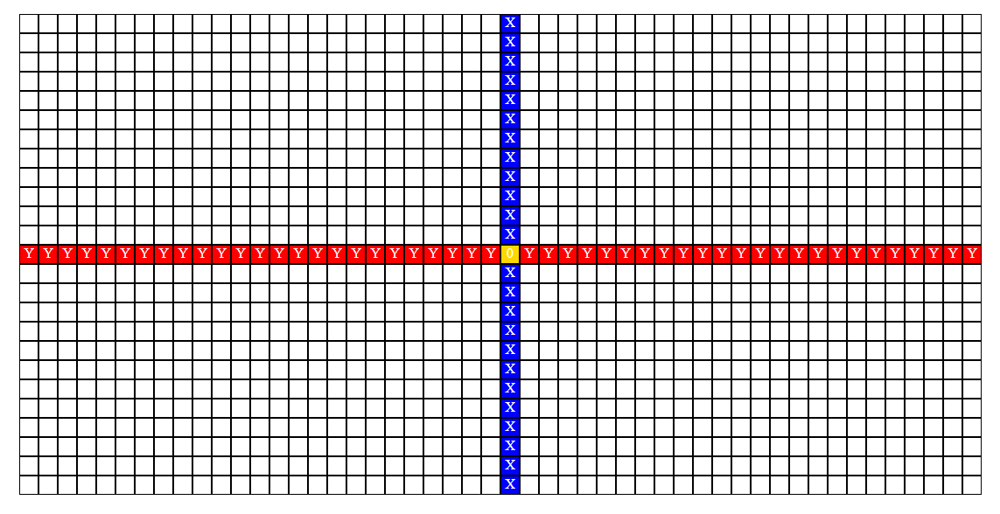

# AdventureGame
Made by Mateo Fernández Rivera (mateonation)

## DESCRIPTION
"AdventureGame" is a simple adventure game that i'm creating using *javascript*, *HTML* and *CSS*.
In this game you control a block that has to reach a goal in each level for them to be completed. Each of these will have different obstacles and tricks that you will have to overcome in order to complete this game.

## HOW TO PLAY
The player controls with *'WASD'* keys a block that is placed in one of the cells that are shown on the screen. The block can be moved to each one of these cells by pressing the previously mentioned keys.
On each level there are a set of obstacles that the player may not overpass. These includes walls, doors, and other stuff. When the player tries to walk over these elements, the game won't let him advance, making him move only on walkable cells.
Also, there are enemies or "death" cells in each level that will "kill" the player if they touch them, making him spawn again at the starting point of the level.

## TO DO
### Make an initial layout
This includes:
- [ ] On the **top of the screen**, a section that shows the _name of the game and it's deveLoper_ ~~(me lol)~~.
- [ ] On the other hand, the **bottom of the screen** may show _information of the current game,_ such as the _number of the level that the player is playing_ at the moment.
- [ ] Finally, at the center of the screen it's gonna be located the **game screen** where a _50x25 cell grid (initially)_[^1] is shown to the user and the _different elements_ of each level can be seen.

### Create initial elements of each level
Each level can contain:
- [ ] **Controllable block.** <ins>The user controls this block with *'WASD'* keys</ins> and moves in a certain direction whenever one of these keys are pressed.
- [ ] **Walkable cells.** The player <ins>can move it's block through the white cells</ins>[^2] of the grid.
- [ ] **Obstacle cells.** These cells can be walls, doors and any other element that <ins>prevent the player from walking over them.</ins>[^3] These cells are distinguishable from the walkable ones because it's color is different.
- [ ] **Death cells.** These are different from the previous ones because they <ins>can *kill* the player if they try to walk over them.</ins>[^4]
- [ ] **Spawn point.** When a player gets *killed* they <ins>get respawned at the start point of each level.</ins>[^5]
- [ ] **Goal Cell.** The moment the goal in a level is reached, <ins>it's considerated as "completed"</ins>[^6] and the player <ins>continues to the next level.</ins>[^7]

### Create the game's grid
[^1]: The grid is generated whenever the *.html* file is opened in a web navigator (Chrome, Edge, Firefox...) and it contains a set of 50 columns and 25 rows of cells.
Each of these cells has an id that contains it's <ins>X position</ins> and it's <ins>Y position</ins> and these values are useful for placing the elements on the grid.
> For example, each time the user presses the *'W' key*, it's Y position increments by one and when the *'A' key* gets pressed it's X position decreases by one.

### Basic events
Events that can occur and be done while playing:
[^2]: If a player presses a *'WASD' key*, their X and Y could update in order to which key was pressed. If the player's X/Y position gets changed, it's going to be reflected on the screen
[^3]: If a player tries to move to a block that's unwalkable, the script won't update their position.
[^4]: If a player makes a move to a *"death" cell*, he will dissappear from that position.
[^5]: When the player gets *"killed"* they're going to be respawned at the starting point of the level.
[^6]: If the level's goal cell is reached, the level will be considered as completed.
[^7]: When a goal is reached, the player gets to the next level.

> [!NOTE]
> ***These functions and it's values are subject to modifications and more can be added in the future.***